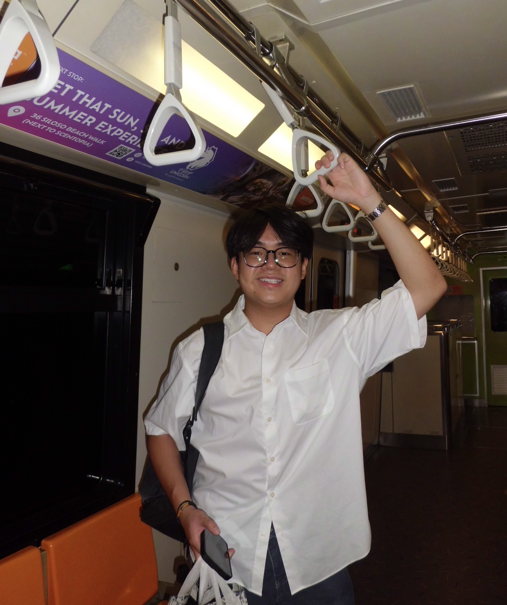

---
layout:default.md
title:"About Us"
---

# About Us

We are a team based in the [School of Computing, National University of Singapore](http://www.comp.nus.edu.sg).

You can reach us at the email `seer[at]comp.nus.edu.sg`

## Project team

### Geng Yudong

[[Github](http://github.com/gengyudong)]
[[Portfolio](team/gengyudong.md)]

* Role: Developer (Team Lead)
* Responsibilities: Feature - Delete Contacts

### Glenn Liew Zi Yi

[[Github](http://github.com/glennliew)]
[[Portfolio](team/glennliew.md)]

* Role: Developer (Documentation)
* Responsibilities: UI

### Hu Junjie

[[Github](http://github.com/grassheadd)] [[Portfolio](team/junjie.md)]

* Role: Developer (Code Quality)
* Responsibilities: Data

### Arulanandam James Beryl

[[Github](https://github.com/jamesberyl)]
[[Portfolio](team/jamesberyl.md)]

* Role: Developer (Testing)
* Responsibilities: Feature - Filter Contacts

### Wei Yan Min Oo

[[Github](http://github.com/weiyanminoo)]
[[Portfolio](team/weiyanminoo.md)]

* Role: Developer (Integration)
* Responsibilities: Feature - Add Contacts
