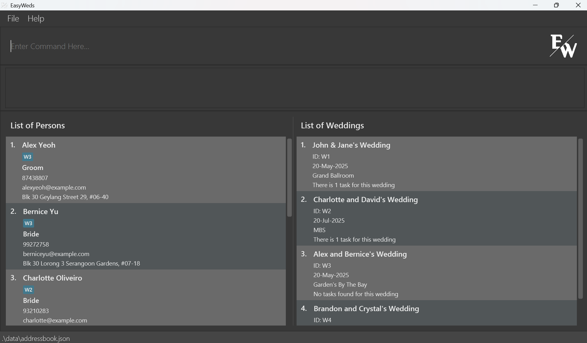

# EasyWeds User Guide

EasyWeds is a **desktop app designed for freelance wedding planners juggling multiple weddings**. It streamlines planning by centralising vendor and client information and keeping every wedding detail organised. If you are adept at typing, EasyWeds empowers you to swiftly access and update your planning data.

## Table of Contents

- [Quick start](#quick-start)
- [Features](#features)
    - [Viewing help](#viewing-help-help)
    - [Adding a person](#adding-a-person-add)
    - [Editing a person](#editing-a-person-edit)
    - [Deleting a person](#deleting-a-person-delete)
    - [Locating persons by name or role](#locating-persons-by-name-or-role-find)
    - [Listing all persons](#listing-all-persons-list)
    - [Adding a Wedding Event](#adding-a-wedding-event-addwedding)
    - [Editing a Wedding Event](#editing-a-wedding-event-editwedding)
    - [Deleting a Wedding Event](#deleting-a-wedding-event-deletewedding)
    - [Listing all Wedding Events](#listing-all-wedding-events-listwedding)
    - [Listing all Wedding Events sorted by earliest date](#listing-all-wedding-events-sorted-by-earliest-date-listweddingsorted)
    - [Adding a Wedding Task](#adding-a-wedding-task-addtask)
    - [Listing all Wedding Tasks](#listing-all-wedding-tasks-listtask)
    - [Marking a Wedding Task](#marking-a-wedding-task-mark)
    - [Unmarking a Wedding Task](#unmarking-a-wedding-task-unmark)
    - [Deleting a Wedding Task](#deleting-a-wedding-task-deletetask)
    - [Tagging a person to a Wedding](#tagging-a-person-to-a-wedding-tag)
    - [Untagging a person](#untagging-a-person-untag)
    - [Filtering contacts](#filtering-contacts-filter)
    - [Clearing all entries](#clearing-all-entries-clear)
    - [Exiting the program](#exiting-the-program-exit)
- [FAQ](#faq)
- [Known issues](#known-issues)
- [Command summary](#command-summary)

--------------------------------------------------------------------------------------------------------------------

## Quick start

1. Ensure you have [Java `17`](https://www.oracle.com/java/technologies/downloads/#java17) (choose the installation package depending on your device e.g mac vs windows) or above installed in your Computer. 
   **Mac users:** Ensure you have the precise JDK version prescribed [here](https://se-education.org/guides/tutorials/javaInstallationMac.html).
   (Relevant tutorial [here](https://se-education.org/guides/tutorials/javaInstallation.html))

1. Download the latest `.jar` file from [here](https://github.com/AY2425S2-CS2103T-F12-2/tp/releases/tag/v1.3).

1. Copy the file to the folder you want to use as the _home folder_ for your EasyWeds.

1. Next, we need you to navigate to the folder you placed the `.jar` file in by opening a command terminal.

1. Open a command terminal,  check the directory you are currently in by typing `ls` which will show you a list of files in the current directory.
   If you see the `.jar` file, you are in the correct directory.
   If not, you can change the directory by typing `cd` followed by the folder name in the command terminal.

   _NOTE: The hierarchy of the folders can be seen by typing `ls` after each `cd` command and the structure follows your files for windows or finder for mac.
   For example, if you have a folder named `NUS` and within it, a folder named `CS2103T`, you can navigate to the `CS2103T` folder by typing `cd NUS` followed by `ls` to see what file is in it, then type`cd CS2103T` in the command terminal._
3. Once you navigate into the correct directory, i.e. when you type `ls`, you see easyweds.jar being listed, type the `java -jar easyweds.jar` command in the command terminal to run the application. 
   A Graphic User Interface(GUI) similar to the below should appear in a few seconds. Note how the app contains some sample data. 
   

1. Type the command in the command box and press Enter to execute it. e.g. typing **`help`** and pressing Enter will open the help window. 
   Some example commands you can try:

   * `list` : Lists all contacts.

   * `add n/John Doe p/98765432 e/johnd@example.com a/John street, block 123, #01-01 r/Photographer` : Adds a contact named `John Doe` to the contact book in EasyWeds.

   * `delete 3` : Deletes the 3rd contact shown in the current list.

   * `clear` : Deletes all contacts.

   * `exit` : Exits the app.

1. Refer to the [Features](#features) below for details of each command.

--------------------------------------------------------------------------------------------------------------------

## Features

<box type="info" seamless>

**Notes about the command format:** 

* Press 'TAB' to auto-complete the command you are typing in the command box. 
  e.g. if you type `ad` and press 'TAB', it will auto-complete to `add ` and if you press it again it will auto-complete to 'addWedding' and if you press it again it will auto-complete to 'addTask'.

* Words in `UPPER_CASE` are the parameters to be supplied by the user. 
  e.g. in `add n/NAME`, `NAME` is a parameter which can be used as `add n/John Doe`.

* Items in square brackets are optional. 
  e.g `edit n/NAME [r/ROLE]` can be used as `edit n/John Doe r/Florist` or as `edit n/John Doe`.

* Parameters can be in any order. 
  e.g. if the command specifies `n/NAME p/PHONE_NUMBER`, `p/PHONE_NUMBER n/NAME` is also acceptable.

* Extraneous parameters for commands that do not take in parameters (such as `help`, `list`, `exit` and `clear`) will be ignored. 
  e.g. if the command specifies `help 123`, it will be interpreted as `help`.

* If you are using a PDF version of this document, be careful when copying and pasting commands that span multiple lines as space characters surrounding line-breaks may be omitted when copied over to the application.
</box>

### Viewing help : `help`

Shows a message explaining how to access the help page.

Format: `help`
* Click on the "Go To User Guide" button and the User Guide will be opened in your default browser.

### Adding a person : `add`

Adds a person to the contact book.

Format: `add n/NAME p/PHONE_NUMBER e/EMAIL a/ADDRESS r/ROLE`

* Input values must be provided for all fields.
* If any of the fields' content include any of the delimiters `n/`, `p/`, `e/`, `a/`, `r/`, include a "\\" before the delimiter. 
  * e.g. Name of a contact is "John p/Doe": `add n/John p/Doe p/98765432 ...` will not be accepted due to a duplicate delimiter `p/`. Instead, use `add n/John \p/Doe p/98765432 ...` to denote that "/p" is indeed part of the name.
  * This applies to all fields.
Examples:
* `add n/John Doe p/98765432 e/johnd@example.com a/John street, block 123, #01-01 r/Photographer`
* `add n/Betsy Crowe r/Florist e/betsycrowe@example.com a/Newgate Prison p/1234567`

**Note:** A person with the same name or a similar name to an existing person in the contacts will be flagged out
* If there is a Person with the name `Alex Yeoh` in the contacts, the following will be flagged out:
    * `Alex Yeoh` (exactly the same)
    * `alex<space>yeoh` (no capitalization)
    * `Alex<space><space>Yeoh` (extra spacing)
    * `Alex<space><space>yeoh` (combination of the 2)
* In such a case, the potential duplicate is spotted and the User will need to confirm if he wants to add this Person or make a change to the input
  
* Once you receive the warning message, you can choose to either:
    1. Confirm - Use 'Ctrl / Command + A' to select the whole input text and press 'Delete / Backspace' to clear the input box. Afterwards, input the command `y` which will add this Person into the contact list.
    2. Cancel - Edit the current input in your input box. Once no duplicates are detected, when you press 'Enter', this Person will be added into the contact list.

### Editing a person : `edit`

Edits an existing person in the contact book.

Format: `edit INDEX [n/NAME] [p/PHONE] [e/EMAIL] [a/ADDRESS] [r/ROLE]`

* Edits the person at the specified `INDEX`. The index refers to the index number shown in the displayed person list. The index **must be a positive integer** 1, 2, 3, …​
* At least one of the optional fields must be provided.
* Existing values will be updated to the input values.

Examples:
*  `edit 1 p/91234567 e/johndoe@example.com` Edits the phone number and email address of the 1st person to be `91234567` and `johndoe@example.com` respectively.
*  `edit 2 n/Betsy Crower r/photographer` Edits the name of the 2nd person to be `Betsy Crower` and her role to `photographer`.

### Deleting a person : `delete`

Deletes the specified person from the contact book.

Format: `delete INDEX`

* Deletes the person at the specified `INDEX`.
* The index refers to the index number shown in the displayed person list.
* The index **must be a positive integer** 1, 2, 3, …​

Examples:
* `list` followed by `delete 2` deletes the 2nd person in the contact book.
* `find Betsy` followed by `delete 1` deletes the 1st person in the results of the `find` command.

### Locating persons by name or role: `find`

Finds persons whose names or roles contain any of the given keywords.

Format: `find KEYWORD [MORE_KEYWORDS]`

* The search is case-insensitive. e.g `hans` will match `Hans`
* The order of the keywords does not matter. e.g. `Hans Bo` will match `Bo Hans`
* Either the name or the role will be searched.
* Only full words will be matched e.g. `Han` will not match `Hans`
* Persons matching at least one keyword will be returned (i.e. `OR` search).
  e.g. `Hans Bo` will return `Hans Gruber`, `Bo Yang`

Examples:
* `find John` returns `john` and `John Doe`
* `find florist` returns all Persons with a role of `florist`
* `find alex david` returns `Alex Yeoh`, `David Li` 

  

### Listing all persons : `list`

Shows a list of all persons in the contact book.

Format: `list`

### Adding a Wedding Event : `addWedding`

Adds a wedding event to the contact book.

Format: `addWedding n/NAME d/DATE l/LOCATION`

* Input values must be provided for all fields.
* If any of the fields' content include any of the delimiters `n/`, `d/`, `l/`, include a "\\" before the delimiter.
    * e.g. Name of a wedding is "John & Jane d/ Doe's Wedding": `addWedding n/John & Jane d/ Doe's Wedding d/20-May-2025 l/Marina Bay Sands` will not be accepted due to a duplicate delimiter `/d`. Instead, use `addWedding n/John & Jane \d/ Doe's Wedding d/20-May-2025 l/Marina Bay Sands` to denote that `d/` is indeed part of the name.
    * This applies to all fields.
* Format of the date is flexible, e.g. "dd-MMM-yyyy", "dd/MM/yyyy", "dd.MM.yyyy", "dd MMM yyyy".
* Date must be a valid date and in the future.

Examples:
* `addWedding n/John & Jane's Wedding d/20-May-2025 l/Marina Bay Sands`

### Editing a Wedding Event : `editWedding`

Edit an existing wedding event in the contact book.

Format: `editWedding WEDDING_ID [n/NAME] [d/DATE] [l/LOCATION]`

* Edits the wedding event at the specified `WEDDING_ID`.
* At least one of the optional fields must be provided.
* Existing values will be updated to the input values.
* Details of wedding you want to edit cannot be the same as what is already in the wedding.

Examples:
* `editWedding W1 d/20-Feb-2025 l/Marina Bay Sands` Edits the date and location of the 1st wedding event to be `20-Feb-2025` and `Marina Bay Sands` respectively.
* `editWedding W2 n/John & Jane's Wedding` Edits the name of the 2nd wedding event to be `John & Jane's Wedding`.

### Deleting a Wedding Event : `deleteWedding`

Deletes the specified wedding event from the contact book.

Format: `deleteWedding WEDDING_ID`

* Deletes the wedding event with the specified `WEDDING_ID`.
* Tags of contacts associated to the deleted wedding event will be removed.

### Listing all Wedding Events : `listWedding`

Shows a list of all wedding events in the contact book.

Format: `listWedding`

### Listing all Wedding Events sorted by earliest date : `listWeddingSorted`

Shows a list of all wedding events in the contact book sorted by the earliest date.

Format: `listWeddingByDate`

### Adding a Wedding Task : `addTask`

Adds a new Task to a specified wedding event.

Format: `addTask w/WEDDING_ID desc/TASK_DESCRIPTION`

* Adds a new Task to a wedding event specified by `WEDDING_ID`.

Examples:
* `addTask w/W1 desc/Book florist` Adds a new Task `Book Florist` to the wedding event`W1`.

### Listing all Wedding Tasks : `listTask`

Shows a list of all Tasks of a specified wedding event.

Format: `listTask w/WEDDING_ID`

Examples: `listWedding w/W1` Show a list of all Tasks of the wedding event `W1`.

### Marking a Wedding Task : `mark`

Marks a specified task of a specified wedding event as completed.

Format: `mark w/WEDDING_ID i/TASK_INDEX`

* Marks the task at the specified `INDEX` from the wedding event specified by `WEDDING_ID` as completed.
* The index refers to the index number shown in the displayed task list. The index **must be a positive integer** 1, 2, 3, …​
* `WEDDING_ID` is the unique identifier of the wedding event.

Examples:
* `mark w/W1 i/1` Marks a Task at index 1 of the wedding event `W1` as completed.

### Unmarking a Wedding Task : `unmark`

Marks a specified task of a specified wedding as not completed.

Format: `unmark w/WEDDING_ID i/TASK_INDEX`

* Marks the task at the specified `INDEX` from the wedding event specified by `WEDDING_ID` as not completed.
* The index refers to the index number shown in the displayed task list. The index **must be a positive integer** 1, 2, 3, …​
* `WEDDING_ID` is the unique identifier of the wedding event.

Examples:
* `unmark w/W1 i/1` Marks a Task at index 1 of the wedding event `W1` as not completed.

### Deleting a Wedding Task : `deleteTask`

Deletes the specified task from a specified wedding event.

Format: `deleteTask w/WEDDING_ID i/TASK_INDEX`

* Deletes the task at the specified `INDEX` from the wedding task list of the wedding event specified by `WEDDING_ID`.
* The index refers to the index number shown in the displayed task list. The index **must be a positive integer** 1, 2, 3, …​
* `WEDDING_ID` is the unique identifier of the wedding event.

Examples:
* `deleteTask w/W1 i/1` Deletes a Task at index 1 from the wedding task list of the wedding event `W1`.

### Tagging a person to a Wedding : `tag`

Tags an existing contact to an existing wedding event.

Format: `tag INDEX WEDDING_ID`

* Tags the person at the specified `INDEX` to the wedding event specified by `WEDDING_ID`.
* The index refers to the index number shown in the displayed person list. The index **must be a positive integer** 1, 2, 3, …​
* `WEDDING_ID` is the unique identifier of the wedding event.
* Contacts can only be tagged to wedding events that are already existing in the system.
* Each contact can be tagged to more than one wedding event.

Examples:
* `tag 1 W1` tags the first person to the wedding event `W1`
* `tag 1 W2` tags the first person to the wedding event `W2`. Now the first person will be tagged to both `W1` and `W2`.

### Untagging a person : `untag`

Untags an existing contact from an existing wedding event.

Format: `untag INDEX WEDDING_ID`

* Untags the person at the specified `INDEX` from the wedding event specified by `WEDDING_ID`.
* The index refers to the index number shown in the displayed person list. The index **must be a positive integer** 1, 2, 3, …​
* `WEDDING_ID` is the unique identifier of the wedding event.
* Contacts can only be untagged from wedding events that are already existing in the system.

Examples:
* `untag 1 W1` untags the first person from the wedding event `W1`

### Filtering contacts : `filter`

Filters contacts related to a specified wedding id.

Format: `filter WEDDING_ID`

* Filters contacts that are tagged with the specified `WEDDING_ID`
* Wedding id is the unique identifier of the wedding event.
* Wedding details of the event specified by `WEDDING_ID` will be displayed on the message output box.

Examples:
* `filter W4` displays the details of `W4` and returns the contacts that are tagged to `W4`.

  

### Clearing all entries : `clear`

Clears all entries from the contact book.

Format: `clear`

**Note:** In order to prevent you from accidentally clearing the contact book (which is unrecoverable), we have included a confirmation check similar to adding duplicates.

### Exiting the program : `exit`

Exits the program.

Format: `exit`

### Saving the data

EasyWeds data are saved in the hard disk automatically after any command that changes the data. There is no need to save manually.

### Editing the data file

EasyWeds data are saved automatically as a JSON file `[JAR file location]/data/addressbook.json`. Advanced users are welcome to update data directly by editing that data file.

<box type="warning" seamless>

**Caution:**
If your changes to the data file makes its format invalid, EasyWeds will discard all data and start with an empty data file at the next run.  Hence, it is recommended to take a backup of the file before editing it. 
Furthermore, certain edits can cause EasyWeds to behave in unexpected ways (e.g., if a value entered is outside the acceptable range). Therefore, edit the data file only if you are confident that you can update it correctly.
</box>

[Back to content page](#table-of-contents)

--------------------------------------------------------------------------------------------------------------------

## FAQ

**Q**: How do I transfer my data to another Computer? 
**A**: Install the app in the other computer and overwrite the empty data file it creates with the file that contains the data of your previous EasyWeds home folder.

--------------------------------------------------------------------------------------------------------------------

## Known issues

1. **When using multiple screens**, if you move the application to a secondary screen, and later switch to using only the primary screen, the GUI will open off-screen. The remedy is to delete the `preferences.json` file created by the application before running the application again.
2. **If you minimize the Help Window** and then run the `help` command (or use the `Help` menu, or the keyboard shortcut `F1`) again, the original Help Window will remain minimized, and no new Help Window will appear. The remedy is to manually restore the minimized Help Window.

--------------------------------------------------------------------------------------------------------------------

## Command summary
| Action                | Format, Examples                                                                                                                                               |
|-----------------------|----------------------------------------------------------------------------------------------------------------------------------------------------------------|
| **Add**               | `add n/NAME p/PHONE_NUMBER e/EMAIL a/ADDRESS r/ROLE…​`   e.g., `add n/James Ho p/22224444 e/jamesho@example.com a/123, Clementi Rd, 1234665 r/Photographer` |
| **Edit**              | `edit INDEX [n/NAME] [p/PHONE] [e/EMAIL] [a/ADDRESS] [r/ROLE]…​`  e.g.,`edit 2 n/James Lee e/jameslee@example.com`                                          |
| **Delete**            | `delete INDEX`  e.g., `delete 3`                                                                                                                            |
| **Find**              | `find KEYWORD [MORE_KEYWORDS]`   e.g., `find James Jake`                                                                                                    |
| **List**              | `list`                                                                                                                                                         |
| **AddWedding**        | `addWedding n/NAME d/DATE l/LOCATION`   e.g., `addWedding n/John and Jane's Wedding d/20-Feb-2025 l/Marina Bay Sands`                                       |
| **EditWedding**       | `editWedding WEDDING_ID [n/NAME] [d/DATE] [l/LOCATION]`   e.g., `editWedding W1 d/20-Feb-2025 l/Marina Bay Sands`                                           |
| **DeleteWedding**     | `deleteWedding WEDDING_ID`   e.g., `deleteWedding W1`                                                                                                       |
| **ListWedding**       | `listWedding`                                                                                                                                                  |
| **ListWeddingSorted** | `listWeddingSorted`   e.g., `listWeddingSorted`                                                                                                             |
| **AddTask**           | `addTask w/WEDDING_ID desc/TASK_DESCRIPTION`   e.g., `addTask w/W1 desc/Book florist`                                                                       |
| **ListTask**          | `listTask w/WEDDING_ID`   e.g., `listTask w/W1`                                                                                                             |
| **Mark**              | `mark w/WEDDING_ID i/TASK_INDEX`   e.g., `mark w/W1 i/1`                                                                                                    |
| **Unmark**            | `unmark w/WEDDING_ID i/TASK_INDEX`   e.g., `unmark w/W1 i/1`                                                                                                |
| **DeleteTask**        | `deleteTask w/WEDDING_ID i/TASK_INDEX`   e.g., `deleteTask w/W1 i/1`                                                                                        |
| **Tag**               | `tag INDEX WEDDING_ID`   e.g., `tag 1 W1`                                                                                                                   |
| **Untag**             | `untag INDEX WEDDING_ID`   e.g., `untag 1 W1`                                                                                                               |
| **Filter**            | `filter WEDDING_ID`   e.g., `filter W4`                                                                                                                     |
| **Clear**             | `clear`                                                                                                                                                        |
| **Exit**              | `exit`                                                                                                                                                         |                                                                                                                                                       |
