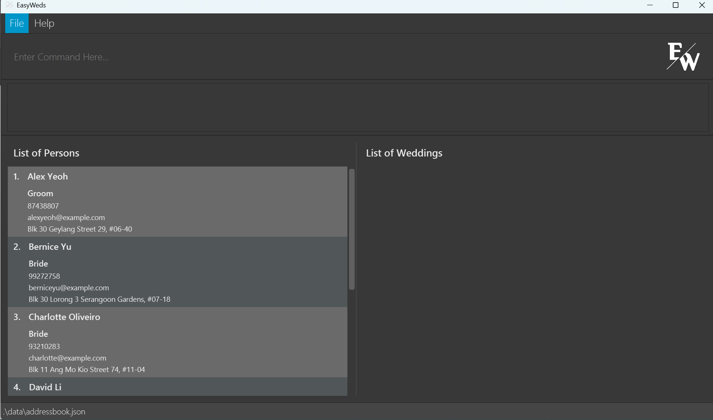
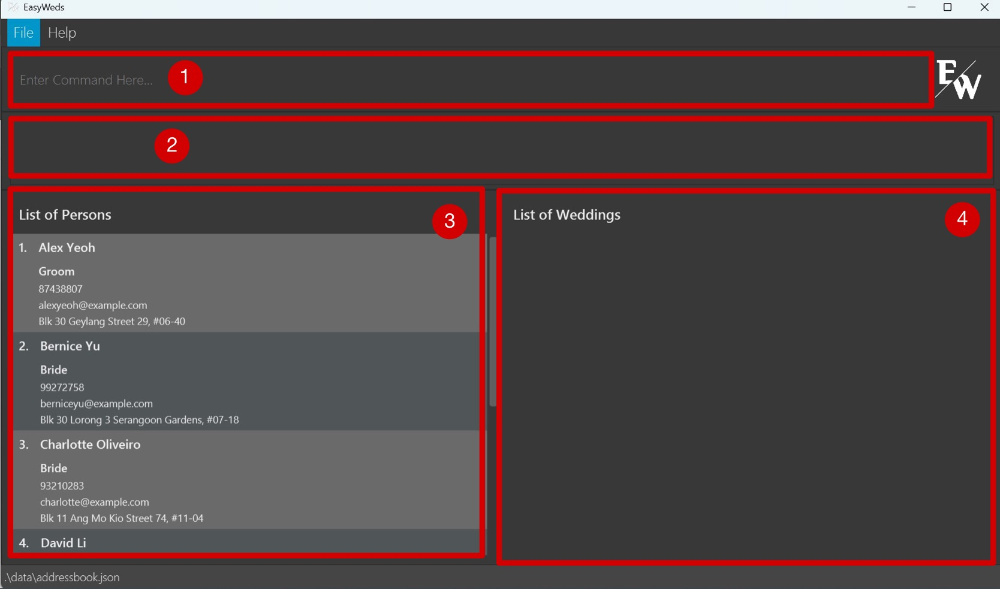
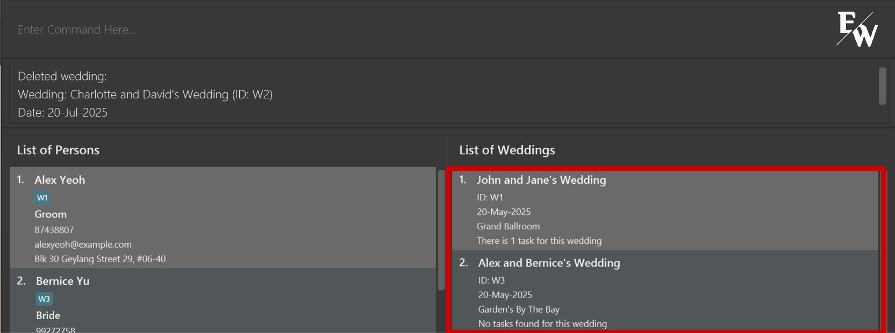
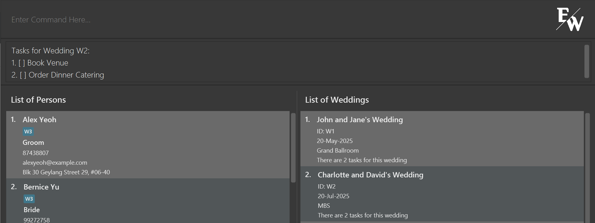
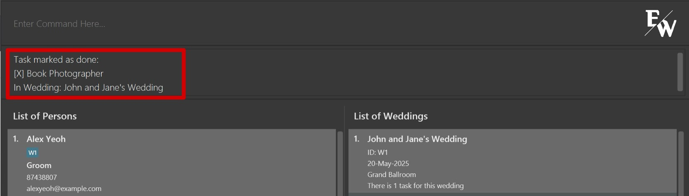
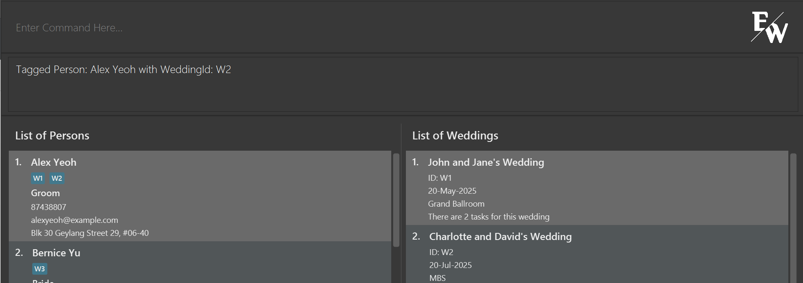
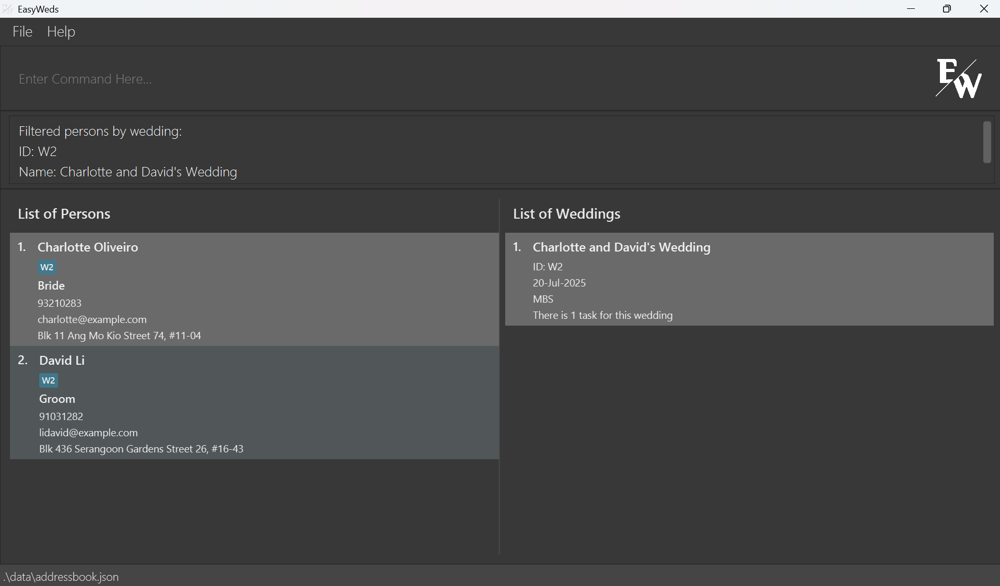
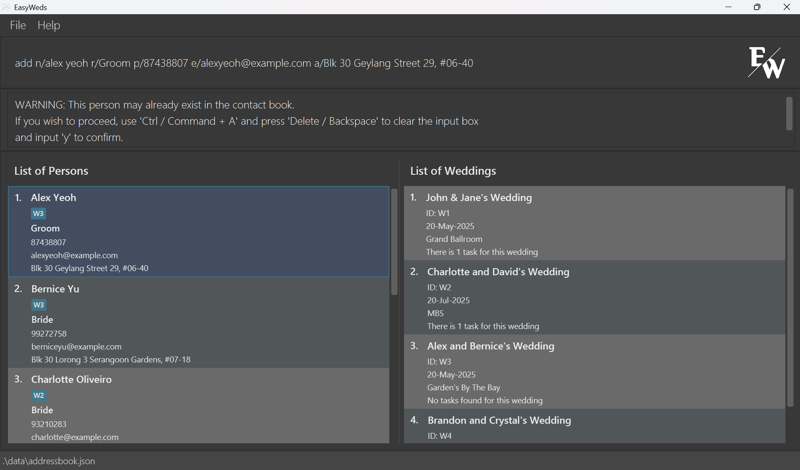

# EasyWeds User Guide
<br>

## About EasyWeds

EasyWeds is a **desktop app designed for freelance wedding planners juggling multiple weddings**. You can use EasyWeds to streamline planning by centralising vendor and client information and keeping every wedding detail organised. If you are adept at typing, EasyWeds empowers you to access and update your planning data swiftly.

Here are  EasyWeds' main features:
#### Enhanced Contact Management
<box type="success" seamless>
  Contact Tracking: Add phone numbers, emails, addresses, and roles
</box>
<box type="success" seamless>
  Contact Linking: Tag your clients and your vendors to wedding events
</box>
<box type="success" seamless>
  Advanced Filters: Filter by name or role
</box>

#### Comprehensive Wedding Management
<box type="success" seamless>
  Wedding Tracking: Add date and location
</box>
<box type="success" seamless>
  Task Management: Add to-do tasks for each wedding
</box>
<box type="success" seamless>
  Advanced Sorting: Sort by wedding ID or date
</box>

<div style="page-break-after: always;"></div>

## Table of Contents

- [Quick start](#quick-start)
- [Terminology](#terminology)
- [Layout](#layout)
- [Features](#features)
    - [Getting Help](#getting-help)
        - [Viewing help](#viewing-help-help)
    - [Managing Contacts](#managing-contacts)
        - [Adding a Person](#adding-a-person-add)
        - [Editing a Person](#editing-a-person-edit)
        - [Deleting a Person](#deleting-a-person-delete)
        - [Locating Persons by name or role](#locating-persons-by-name-or-role-find)
    - [Managing Wedding Events](#managing-wedding-events)
        - [Adding a Wedding Event](#adding-a-wedding-event-addwedding)
        - [Editing a Wedding Event](#editing-a-wedding-event-editwedding)
        - [Deleting a Wedding Event](#deleting-a-wedding-event-deletewedding)
        - [Sorting all Wedding Events by increasing Wedding ID](#sorting-all-wedding-events-by-increasing-wedding-id-sortwid)
        - [Sorting all Wedding Events by earliest date](#sorting-all-wedding-events-by-earliest-date-sortwdate)
    - [Managing Wedding Tasks](#managing-wedding-tasks)
        - [Adding a Wedding Task](#adding-a-wedding-task-addtask)
        - [Listing all Wedding Tasks](#listing-all-wedding-tasks-listtask)
        - [Marking a Wedding Task](#marking-a-wedding-task-mark)
        - [Unmarking a Wedding Task](#unmarking-a-wedding-task-unmark)
        - [Deleting a Wedding Task](#deleting-a-wedding-task-deletetask)
    - [Managing Tags](#managing-tags)
        - [Tagging a person to a Wedding](#tagging-a-person-to-a-wedding-tag)
        - [Untagging a person](#untagging-a-person-untag)
        - [Filtering contacts](#filtering-contacts-filter)
    - [Data Management](#data-management)
        - [Listing all Persons and Wedding Events](#listing-all-persons-and-wedding-events-list)
        - [Clearing all entries](#clearing-all-entries-clear)
        - [Saving the data](#saving-the-data)
        - [Editing the data file](#editing-the-data-file)
    - [Exiting the program](#exiting-the-program)
        - [Exiting the program](#exiting-the-program-exit)
- [FAQ](#faq)
- [Known issues](#known-issues)
- [Command summary](#command-summary)

<div style="page-break-after: always;"></div>

## Quick Start

1. Ensure you have [Java `17`](https://www.oracle.com/java/technologies/downloads/#java17) or above installed in your computer.<br>
   Choose the installation package depending on your device: [Mac](https://se-education.org/guides/tutorials/javaInstallationMac.html), [Windows](https://se-education.org/guides/tutorials/javaInstallationWindows.html) or [Linux](https://se-education.org/guides/tutorials/javaInstallationLinux.html)

    <box type="tip" seamless>
    
    **Tip:** Refer to this [Tutorial](https://se-education.org/guides/tutorials/javaInstallation.html) for help with installing Java.
    </box>

2. Download the latest `.jar` file from [here](https://github.com/AY2425S2-CS2103T-F12-2/tp/releases/tag/v1.6).

3. Copy the file to the folder you want to use as the _home folder_ for your EasyWeds.

4. Open a command terminal, `cd` into the folder you put the jar file in, and use the `java -jar easyweds.jar` command to run the application.

5. A Graphic User Interface (GUI) similar to the screenshot below should appear in a few seconds. Note how the app contains some sample data.
<br>

    

6. Type the command in the command box and press Enter to execute it. e.g. typing **`help`** and pressing Enter will open the help window.<br>
   Some example commands you can try:

    * `list`: Lists all persons and wedding events.

    * `add n/John Doe p/98765432 e/johnd@example.com a/John street, block 123, #01-01 r/Photographer`: Adds a contact named `John Doe` to the contact book in EasyWeds.

    * `delete 3`: Deletes the 3rd contact shown in the current list.

    * `clear`: Deletes entire contact book (both persons and wedding events).

    * `exit`: Exits the app.

7. Refer to the [Features](#features) below for details of each command.

<box type="tip" seamless>

**Tip:** Refer to [FAQ](#faq) for help on setting up.
</box>

<div style="page-break-after: always;"></div>

## Terminology
In this guide, the following terms are used:
- **Contact(s)** and **Person(s)**: These terms are used interchangeably and refer to the individuals (vendors & clients) stored in EasyWeds.
- **Contact book**: Refers to the list of contacts and weddings in EasyWeds.
- **JSON**: A data format used to store information regarding the contacts and weddings for EasyWeds.
- **Graphic User Interface**: A graphic user interface (GUI) is a visual way for users to interact with a software application, using elements such as buttons, windows, icons, and menus.
- **Command Line Interface**: A command line interface (CLI) is a text-based interface that allows users to interact with a program by typing commands into a terminal or console.

--- {.border-secondary}

<br>

## Layout
When you launch EasyWeds, EasyWeds appears on your screen as a Graphical User Interface, or GUI. Let’s look at the layout of the different components of EasyWeds.

EasyWed’s GUI consists of a single main window, as well as the Help Window. The main window consists of four components:

1. Command Input
1. Output Box
1. List of Persons
1. List of Weddings


The following picture of the main window shows the four components, numbered accordingly:



Besides the main window, EasyWeds also has the Help Window. It is not part of the main GUI and is only shown after a [Help Command](#viewing-help-help) is run.

<div style="page-break-after: always;"></div>

## Features

<box type="note" seamless>

**Notes about the command format:**<br>

* Press 'TAB' to auto-complete the command you are typing in the command box.<br>
  e.g. if you type `ad` and press 'TAB', it will auto-complete to `add` and if you press it again it will auto-complete to `addWedding` and if you press it again it will auto-complete to `addTask`.

* Words in `UPPER_CASE` are the parameters to be supplied by the user.<br>
  e.g. in `add n/NAME`, `NAME` is a parameter which can be used as `add n/John Doe`.

* Items in square brackets are optional.<br>
  e.g `edit 1 n/NAME [r/ROLE]` can be used as `edit 1 n/John Doe r/Florist` or as `edit 1 n/John Doe`.

* Parameters can be in any order.<br>
  e.g. if the command specifies `n/NAME p/PHONE_NUMBER`, `p/PHONE_NUMBER n/NAME` is also acceptable.

* Extraneous parameters for commands that do not take in parameters (such as `help`, `list`, `exit` and `clear`) will be ignored.<br>
  e.g. if the command specifies `help 123`, it will be interpreted as `help`.

* If you are using a PDF version of this document, be careful when copying and pasting commands that span multiple lines as space characters surrounding line-breaks may be omitted when copied over to the application.
  </box>

--- {.border-secondary}

<br>

## Getting Help
<br>

### Viewing help: `help`

Shows a message explaining how to access the help page.

Format: `help`


<box type="tip" seamless>

**Tip:** Click on the "Go To User Guide" button and the User Guide will be opened in your default browser.
</box>

<div style="page-break-after: always;"></div>

## Managing Contacts
<br>

### Adding a Person: `add`

Adds a person to the contact book.

Format: `add n/NAME p/PHONE_NUMBER e/EMAIL a/ADDRESS r/ROLE`

<box type="info" seamless>

* Input values must be provided for all fields.
* Your name will appear in the contact book exactly as you entered it.
* Only alphanumeric latin characters are allowed for the name field.
* A person with the [same name or a similar name](#duplicate-section) to an existing person in the contacts will be flagged out. 
* If any of the fields' content include any of the delimiters `n/`, `p/`, `e/`, `a/`, `r/`, include a `\` before the delimiter.
    * e.g. Name of a contact is "John p/Doe": `add n/John p/Doe p/98765432 ...` will not be accepted due to a duplicate delimiter `p/`. Instead, use `add n/John \p/Doe p/98765432 ...` to denote that "/p" is indeed part of the name.
    * This applies to all fields.
</box>

<box type="definition" seamless>

Examples:
```
add n/John Doe p/87654321 e/johnd@example.com a/John street, block 123, #01-01 r/Photographer
```
This command adds a person named `John Doe` with the phone number `87654321`, email `johnd@example.com`, address `John street, block 123, #01-01`, and role `Photographer`.

<br>

```
add n/Betsy Crowe r/Florist e/betsycrowe@example.com a/Blk 321 Clementi West St 1 p/12345678
```
This command adds a person named `Betsy Crowe` with the role `Florist`, email `betsycrowe@example.com`, address `Blk 321 Clementi West St 1`, and phone number `12345678`.
</box>

<br>

### Editing a Person: `edit`

Edits an existing person in the contact book.

Format: `edit INDEX [n/NAME] [p/PHONE] [e/EMAIL] [a/ADDRESS] [r/ROLE]`

<box type="info" seamless>

* Edits the person at the specified `INDEX`. The index refers to the index number shown in the displayed person list. The index **must be a positive integer** 1, 2, 3, …​
* At least one of the optional fields must be provided.
* Existing values will be updated to the input values.
* Similar to adding a person, there will be a check for [duplicates](#duplicate-section) for the person's name
</box>

<box type="definition" seamless>

Examples:
```
edit 1 p/91234567 e/johndoe@example.com
```
This command edits the phone number and the email address of the 1st person to be `91234567` and `johndoe@example.com` respectively.

<br>

```
edit 2 n/Betsy Crower r/photographer
```
This command edits the name and the role of the 2nd person to be `Betsy Crower` and `photographer` respectively.
</box>

<div style="page-break-after: always;"></div>

### Deleting a Person: `delete`

Deletes the specified person from the contact book.

Format: `delete INDEX`

<box type="info" seamless>

* Deletes the person at the specified `INDEX`.
* The index refers to the index number shown in the displayed person list.
* The index **must be a positive integer** 1, 2, 3, …​
</box>

<box type="definition" seamless>

Examples:
```
list
```
```
delete 2
```
This command deletes the 2nd person in the contact book.

<br>

```
find Betsy
``` 
```
delete 1
```
This command deletes the 1st person in the results of the `find` command.
</box>

<div style="page-break-after: always;"></div>

### Locating Persons by name or role: `find`

Finds persons whose names or roles contain any of the given keywords.

Format: `find KEYWORD [MORE_KEYWORDS]`

<box type="info" seamless>

* The search is case-insensitive. e.g `hans` will match `Hans`
* The order of the keywords does not matter. e.g. `Hans Bo` will match `Bo Hans`
* Either the name or the role will be searched.
* Only full words will be matched e.g. `Han` will not match `Hans`
* Persons matching at least one keyword will be returned (i.e. `OR` search).
  e.g. `Hans Bo` will return `Hans Gruber`, `Bo Yang`
</box>

<box type="definition" seamless>

Examples:
```
find John
``` 
This command returns `john` and `John Doe`

<br>

```
find florist
``` 
This command returns all Persons with the role of `florist`

<br>

```
find alex david
``` 
This command returns `Alex Yeoh`, `David Li` (Refer to the image below) 

<br>


</box>

<box type="tip" seamless>

**Tip:** In order for the 'find' by role command to be effective, ensure that you use the same noun for the same type of role (e.g. please do not call one person 'florist' and another person 'flower maker' and instead choose to give the same role to both)
</box>

<div style="page-break-after: always;"></div>

## Managing Wedding Events
<br>

### Adding a Wedding Event: `addWedding`

Adds a wedding event to the contact book.

Format: `addWedding n/NAME d/DATE l/LOCATION`

<box type="info" seamless>

* Input values must be provided for all fields.
* If any of the fields' content includes any of the delimiters `n/`, `d/`, `l/`, include a `\` before the delimiter.
    * E.g. Name of a wedding is "John & Jane d/ Doe's Wedding": `addWedding n/John & Jane d/ Doe's Wedding d/20-May-2026 l/Marina Bay Sands` will not be accepted due to a duplicate delimiter `/d`. Instead, use `addWedding n/John & Jane \d/ Doe's Wedding d/20-May-2026 l/Marina Bay Sands` to denote that `d/` is indeed part of the name.
    * This applies to all fields.
* Format of the date is flexible, e.g. "dd-MMM-yyyy", "dd/MM/yyyy", "dd.MM.yyyy", "dd MMM yyyy".
* If using `MMM` format, only the first letter should be capitalized (e.g. Jan, Feb).
* Date must be a valid date and in the future.
</box>

<box type="definition" seamless>

Examples:
```
addWedding n/John & Jane's Wedding d/20-May-2026 l/Marina Bay Sands
```
This command adds a wedding event named `John & Jane's Wedding` on `20-May-2026` at `Marina Bay Sands`.
</box>

<br>

### Editing a Wedding Event: `editWedding`

Edits an existing wedding event in the contact book.

Format: `editWedding WEDDING_ID [n/NAME] [d/DATE] [l/LOCATION]`

<box type="info" seamless>

* Edits the wedding event at the specified `WEDDING_ID`.
* At least one of the optional fields must be provided.
* Existing values will be updated to the input values.
* Details of the wedding you want to edit cannot be the same as what is already in the wedding.
</box>

<box type="definition" seamless>

Examples:
```
editWedding W1 d/20-Jun-2026 l/Marina Bay Sands
```
This command edits the date and location of the 1st wedding event to be `20-Jun-2026` and `Marina Bay Sands` respectively.

<br>

```
editWedding W2 n/John & Jane's Wedding
```
This command edits the name of the 2nd wedding event to be `John & Jane's Wedding`.
</box>

<div style="page-break-after: always;"></div>

### Deleting a Wedding Event: `deleteWedding`

Deletes the specified wedding event from the contact book.

Format: `deleteWedding WEDDING_ID`

<box type="info" seamless>

* Deletes the wedding event with the specified `WEDDING_ID`.
* Tags of contacts associated with the deleted wedding event will be removed.
</box>

<box type="definition" seamless>

Examples:
```
deleteWedding W2
```
This command deletes the wedding event with ID `W2` (Refer to the image below)

<br>


</box>

<br>

### Sorting all Wedding Events by increasing Wedding ID: `sortWID`

Shows a list of all wedding events in the contact book sorted by increasing Wedding ID.

Format: `sortWID`

<br>

### Sorting all Wedding Events by earliest Date: `sortWDate`

Shows a list of all wedding events in the contact book sorted by date, from earliest to latest.

Format: `sortWDate`

<div style="page-break-after: always;"></div>

## Managing Wedding Tasks
<br>

### Adding a Wedding Task: `addTask`

Adds a new task to a specified wedding event.

Format: `addTask w/WEDDING_ID desc/TASK_DESCRIPTION`

<box type="info" seamless>

* Adds a new task to a wedding event specified by `WEDDING_ID`.
</box>

<box type="definition" seamless>

Examples:
```
addTask w/W1 desc/Book florist
```
This command adds a new task `Book Florist` to the wedding event `W1`.
</box>

<br>

### Listing all Wedding Tasks: `listTask`

Shows a list of all tasks of a specified wedding event in the output box.

Format: `listTask w/WEDDING_ID`

<box type="definition" seamless>

Examples:
```
listTask w/W2
```
This command shows a list of all tasks of the wedding event `W2` (Refer to the image below)

<br>


</box>

<br>

### Marking a Wedding Task: `mark`

Marks a specified task of a specified wedding event as completed.

Format: `mark w/WEDDING_ID i/TASK_INDEX`

<box type="info" seamless>

* Marks the task at the specified `INDEX` from the wedding event specified by `WEDDING_ID` as completed.
* The index refers to the index number shown in the displayed task list. The index **must be a positive integer** 1, 2, 3, …​
* `WEDDING_ID` is the unique identifier of the wedding event.
</box>

<box type="definition" seamless>

Examples:
```
mark w/W1 i/1
```
This command marks the Task at index 1 of the wedding event `W1` as completed (Refer to the image below)

<br>


</box>

<br>

### Unmarking a Wedding Task: `unmark`

Marks a specified task of a specified wedding as not completed.

Format: `unmark w/WEDDING_ID i/TASK_INDEX`

<box type="info" seamless>

* Marks the task at the specified `INDEX` from the wedding event specified by `WEDDING_ID` as not completed.
* The index refers to the index number shown in the displayed task list. The index **must be a positive integer** 1, 2, 3, …​
* `WEDDING_ID` is the unique identifier of the wedding event.
</box>

<box type="definition" seamless>

Examples:
```
unmark w/W1 i/1
```
This command marks the task at index 1 of the wedding event `W1` as not completed.
</box>

<br>

### Deleting a Wedding Task: `deleteTask`

Deletes the specified task from a specified wedding event.

Format: `deleteTask w/WEDDING_ID i/TASK_INDEX`

<box type="info" seamless>

* Deletes the task at the specified `INDEX` from the wedding task list of the wedding event specified by `WEDDING_ID`.
* The index refers to the index number shown in the displayed task list. The index **must be a positive integer** 1, 2, 3, …​
* `WEDDING_ID` is the unique identifier of the wedding event.
</box>

<box type="definition" seamless>

Examples:
```
deleteTask w/W1 i/1
```
This command deletes a task at index 1 from the wedding task list of the wedding event `W1`.
</box>

<div style="page-break-after: always;"></div>

## Managing Tags
<br>

### Tagging a Person to a Wedding: `tag`

Tags an existing contact to an existing wedding event.

Format: `tag INDEX WEDDING_ID`

<box type="info" seamless>

* Tags the person at the specified `INDEX` to the wedding event specified by `WEDDING_ID`.
* The index refers to the index number shown in the displayed person list. The index **must be a positive integer** 1, 2, 3, …​
* `WEDDING_ID` is the unique identifier of the wedding event.
* Contacts can only be tagged to wedding events that are already existing in the system.
* Each contact can be tagged to more than one wedding event.
</box>

<box type="definition" seamless>

Examples:
```
tag 1 W1 
```
This command tags the first person to the wedding event `W1`

<br>

```
tag 1 W2
```
This command tags the first person to the wedding event `W2`. Now the first person will be tagged to both `W1` and `W2`. (Refer to the image below)

<br>


</box>

<div style="page-break-after: always;"></div>

### Untagging a Person: `untag`

Untags an existing contact from an existing wedding event.

Format: `untag INDEX WEDDING_ID`

<box type="info" seamless>

* Untags the person at the specified `INDEX` from the wedding event specified by `WEDDING_ID`.
* The index refers to the index number shown in the displayed person list. The index **must be a positive integer** 1, 2, 3, …​
* `WEDDING_ID` is the unique identifier of the wedding event.
* Contacts can only be untagged from wedding events that are already existing in the system.
</box>

<box type="definition" seamless>

Examples:
```
untag 1 W1
```
This command untags the first person from the wedding event `W1`
</box>

<br>

### Filtering Contacts: `filter`

Filters contacts related to a specified wedding ID.

Format: `filter WEDDING_ID`

<box type="info" seamless>

* Filters contacts that are tagged with the specified `WEDDING_ID`
* Wedding ID is the unique identifier of the wedding event.
* Only the wedding event corresponding to the `WEDDING_ID` will be displayed in the list of weddings.
</box>

<box type="definition" seamless>

Examples:
```
filter W2
```
This command displays the details of `W2` and returns the contacts that are tagged to `W2`. (Refer to the image below)

<br>


</box>

<div style="page-break-after: always;"></div>

## Data Management
<br>

### Listing all Persons and Wedding Events: `list`

Shows a list of all persons and weddings in the contact book.

Format: `list`

<box type="tip" seamless>

**Tip:** Remember to use `list` to show the full contact book again after you used `find` and `filter`.
</box>

<br>

### Clearing all entries: `clear`

Clears all entries from the contact book.

Format: `clear`

<box type="tip" seamless>

**Tip:** In order to prevent you from accidentally clearing the contact book (which is unrecoverable), we have included a [Confirmation Check](#confirmation-section) similar to adding duplicates.
</box>

<br>

### Saving the data

EasyWeds data are saved in the hard disk automatically after any command that changes the data. There is no need to save manually.

<br>

### Editing the data file

EasyWeds data are saved automatically as a JSON file: `[JAR file location]/data/addressbook.json`. Advanced users are welcome to update data directly by editing that data file.

<box type="warning" seamless>

**Caution:** <br>
As much as you are able to manually edit the details of contacts and wedding events, you are strongly advised against editing the weddingIDs in the data file as this will very likely cause the application to behave in unexpected ways.

If your changes to the data file make its format invalid, EasyWeds will discard all data and start with an empty data file at the next run. Hence, it is recommended to take a backup of the file before editing it.<br>

Furthermore, certain edits can cause EasyWeds to behave in unexpected ways (e.g. if a value entered is outside the acceptable range). Therefore, edit the data file only if you are confident that you can update it correctly.
</box>

--- {.border-secondary}

<br>

## Exiting the program
<br>

### Exiting the program: `exit`

Exits the program.

Format: `exit`

[Back to content page](#table-of-contents)

<div style="page-break-after: always;"></div>

<br>

## FAQ

<box type="important" seamless icon=":question:">

"How do I know if I have Java installed or what version I have?"

</box>

<box type="success" seamless>

* Open a terminal (for macOS/Linux) or command prompt (for Windows).
* Type in this command: ```java -version```
* If you have Java installed, you will see a version number that looks like this: "17.0.1" (or higher).
* If you don’t have Java installed or see a version lower than 17, download the latest JDK from [here](https://www.oracle.com/java/technologies/javase/jdk17-archive-downloads.html).

</box>

--- {.border-secondary}

<box type="important" seamless icon=":question:">

"What is the home folder and where do I copy the file?"

</box>

<box type="success" seamless>

* You can choose any folder to be the home folder where you want to store your EasyWeds files.
* Choose a folder location which you can find easily afterwards (e.g. Documents).
* Copy (or move) the downloaded .jar file into this folder, which will contain your EasyWeds data as you use the application.

</box>

--- {.border-secondary}

<box type="important" seamless icon=":question:">

"How do I open a command terminal and navigate to a folder?"

</box>

<box type="success" seamless>

On Windows:

Press Win + R, type `cmd`, and press Enter to open the command prompt.
Use the `cd` command to navigate to your folder. For example, if your file is on the Desktop, type:
```
cd Desktop
```

On MacOS:

Press Command + Space, type `Terminal`, and press Enter.
Use the `cd` command to navigate to your folder. For example, if your file is on the Desktop, type:
```
cd ~/Desktop
```

On Linux:

Open your terminal (typically found in Applications > Utilities or by pressing Ctrl + Alt + T).
Use the `cd` command to navigate to your folder. For example, if your file is in your home directory, type:
```
cd ~
```

</box>

--- {.border-secondary}

<box type="important" seamless icon=":question:">

"Why do I get an error when I try to run the command java -jar easyweds.jar."

</box>

<box type="success" seamless>

Ensure that you have typed in the exact name of the .jar file. If the file was renamed, use that name in the command instead:
```
java -jar "<name_of_file>.jar"
```
</box>

--- {.border-secondary}

<box type="important" seamless icon=":question:">

"How do I transfer my data to another Computer?"

</box>

<box type="success" seamless>

Install the app on the other computer and overwrite the empty data file it creates with the file that contains the data of your previous EasyWeds home folder.

</box>

--- {.border-secondary}

<div id="duplicate-section">

<box type="important" seamless icon=":question:">

"What is considered as a duplicate name?"

</box>

<box type="success" seamless>

* If there is a Person with the name `Alex Yeoh` in the contacts (Refer to the image below), the following will be flagged out:
    * `Alex Yeoh` (exactly the same)
    * `alex<space>yeoh` (no capitalization)
    * `Alex<space><space>Yeoh` (extra spacing)
    * `Alex<space><space>yeoh` (combination of the 2)
* In such a case, the potential duplicate is spotted and the User will need to confirm if he wants to add this Person or make a change to the input



</box>

</div>

--- {.border-secondary}

<div id="confirmation-section">

<box type="important" seamless icon=":question:">

"How do I make a confirmation or cancellation of my previous command?"

</box>

<box type="success" seamless>

Once you receive the warning message, you can choose to either:
1. Confirm - Use 'Ctrl / Command + A' to select the whole input text and press 'Delete / Backspace' to clear the input box. Afterwards, input the command `y` which will add this Person into the contact list.
2. Cancel - Edit the current input in your input box. Once no duplicates are detected, when you press 'Enter', this Person will be added into the contact list.

</box>

</div>

--- {.border-secondary}

<br>

## Known issues

1. **When using multiple screens**, if you move the application to a secondary screen, and later switch to using only the primary screen, the GUI will open off-screen. The remedy is to delete the `preferences.json` file created by the application before running the application again.
2. **If you minimize the Help Window** and then run the `help` command (or use the `Help` menu, or the keyboard shortcut `F1`) again, the original Help Window will remain minimized, and no new Help Window will appear. The remedy is to manually restore the minimized Help Window.

<div style="page-break-after: always;"></div>

## Command summary

| Action                           | Format, Examples                                                                                                                                               |
|----------------------------------|----------------------------------------------------------------------------------------------------------------------------------------------------------------|
| **Add Person**                   | `add n/NAME p/PHONE_NUMBER e/EMAIL a/ADDRESS r/ROLE…​` <br> e.g., `add n/James Ho p/22224444 e/jamesho@example.com a/123, Clementi Rd, 1234665 r/Photographer` |
| **Edit Person**                  | `edit INDEX [n/NAME] [p/PHONE] [e/EMAIL] [a/ADDRESS] [r/ROLE]…​`<br> e.g.,`edit 2 n/James Lee e/jameslee@example.com`                                          |
| **Delete Person**                | `delete INDEX`<br> e.g., `delete 3`                                                                                                                            |
| **Find Person**                  | `find KEYWORD [MORE_KEYWORDS]` <br> e.g., `find James Jake`                                                                                                    |
| **Add Wedding**                  | `addWedding n/NAME d/DATE l/LOCATION` <br> e.g., `addWedding n/John and Jane's Wedding d/20-Feb-2026 l/Marina Bay Sands`                                       |
| **Edit Wedding**                 | `editWedding WEDDING_ID [n/NAME] [d/DATE] [l/LOCATION]` <br> e.g., `editWedding W1 d/20-Feb-2026 l/Marina Bay Sands`                                           |
| **Delete Wedding**               | `deleteWedding WEDDING_ID` <br> e.g., `deleteWedding W1`                                                                                                       |
| **Sort Wedding List by Id**      | `sortWID`                                                                                                                                                      |
| **Sort Wedding List by Date**    | `sortWDate`                                                                                                                                                    |
| **Add Task to a Wedding**        | `addTask w/WEDDING_ID desc/TASK_DESCRIPTION` <br> e.g., `addTask w/W1 desc/Book florist`                                                                       |
| **List Tasks of a Wedding**      | `listTask w/WEDDING_ID` <br> e.g., `listTask w/W1`                                                                                                             |
| **Mark Task as Complete**        | `mark w/WEDDING_ID i/TASK_INDEX` <br> e.g., `mark w/W1 i/1`                                                                                                    |
| **Mark Task as Incomplete**      | `unmark w/WEDDING_ID i/TASK_INDEX` <br> e.g., `unmark w/W1 i/1`                                                                                                |
| **Delete Task in a Wedding**     | `deleteTask w/WEDDING_ID i/TASK_INDEX` <br> e.g., `deleteTask w/W1 i/1`                                                                                        |
| **Tag Wedding to a Person**      | `tag INDEX WEDDING_ID` <br> e.g., `tag 1 W1`                                                                                                                   |
| **Untag Person from a Wedding**  | `untag INDEX WEDDING_ID` <br> e.g., `untag 1 W1`                                                                                                               |
| **Filter Details of a Wedding**  | `filter WEDDING_ID` <br> e.g., `filter W4`                                                                                                                     |
| **List All Contacts & Weddings** | `list`                                                                                                                                                         |
| **Clear All Content**            | `clear`                                                                                                                                                        |
| **Exit EasyWeds**                | `exit`                                                                                                                                                         |                                                                                                                                                       |
